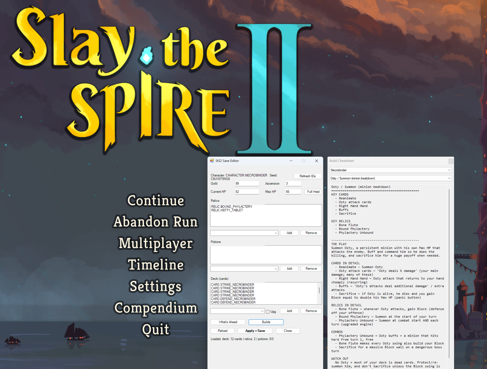

# StS2 Save Editor + Build Cheatsheet

A small, free tool for **Slay the Spire 2** (early access): edit your run, see what's
coming up on your path, and browse a built-in build cheatsheet for every character.
No install, no programming, all plain-text so you can read exactly what it does.

> ⚠️ **Single-player only. Back up your saves. Use at your own risk.** It edits your
> local run file directly, and is not affiliated with or endorsed by Mega Crit.

 

## ⬇️ Download & run — about a minute, no coding needed

You do **not** need Git, an account, programming knowledge, or to install anything.

1. **[⬇️ Click here to download](https://github.com/Kelevrust/sts2-save-editor/releases/latest)** — on that page, under **Assets**, click **`StS2-Save-Editor.zip`**.
2. **Unblock it.** Find the downloaded ZIP, **right-click → Properties → tick the "Unblock" box → OK.** (Windows flags anything from the internet; doing this now means no scary popups later. It's one click.)
3. **Extract it.** Right-click the ZIP → **Extract All…** → Extract.
4. **Run it.** Open the extracted folder and **double-click `Run-Editor.bat`.**

That's the whole thing — the editor finds your save automatically.

> 😟 **See a blue "Windows protected your PC" box?** That only happens if you skipped the
> Unblock step. It's not a virus warning — Windows is just cautious about small unsigned
> tools. Click **More info → Run anyway.** (Or close it, do step 2 above, and reopen — it
> won't come back.) Everything here is plain-text PowerShell you can read, and you can
> scan it on [VirusTotal](https://www.virustotal.com/) if you like.

## ⚠️ Important: turn off Steam Cloud for StS2, or your edits won't stick

This trips up almost everyone. Steam re-downloads its cloud copy over your edit, so:

1. In Steam: right-click **Slay the Spire 2** → **Properties** → **General** →
   uncheck **"Keep game saves in the Steam Cloud for Slay the Spire 2."**
2. **Fully quit the game** before editing (all the way out, not just to the menu).
3. Edit → save → relaunch the game.

If an edit ever "doesn't work," Steam Cloud is still on somewhere.

> **Play on more than one device (a Steam Deck, a second PC)?** This editor is Windows-only,
> so you'd edit on your PC while another device may hold a different run. Edit on the
> machine with the run you actually want, keep Cloud off while you do it, and if Steam later
> shows a **Cloud Conflict** (when you re-enable Cloud or launch on the other device),
> choose the version you just edited — otherwise you could overwrite a newer run. Safest:
> do all your editing in one place.

## What it does

- **Edit your current run** — gold, current/max HP (with Full Heal), ascension.
- **Add or remove relics, potions, and cards** from searchable dropdowns containing
  *every* item in the game (auto-pulled from the game files), with friendly names and an
  "upgraded" toggle for cards.
- **What's Ahead** — shows the exact upcoming normal fights, elites, ? events, and boss
  for each act, read straight from your save. (A route planner, not a seed predictor — it
  only reveals what your run has already rolled.)
- **Builds** — a side drawer: pick a class, pick a build, and see the key cards/relics up
  top with the play breakdown below. All five classes.
- **Refresh IDs** — re-scans the game so the item lists stay current after a patch.
- **Safe by default** — every save is backed up first (to a `backups` folder), and it
  warns you if the game is running, the save version looks unfamiliar, or it's a
  multiplayer save.

## Requirements

- **Windows** (the editor uses built-in Windows tools — no Mac/Linux/Steam Deck).
- **Slay the Spire 2** installed through Steam (paths are found automatically; if not,
  it'll pop a file picker).

## Good to know (the honest bit)

- **Early access.** StS2 keeps changing. The item lists self-heal via **Refresh IDs**, and
  the editor refuses to save if it doesn't recognize your save's version (so a future
  patch can't silently corrupt a run).
- **The build cheatsheet is opinion.** Card and relic *effects* come straight from the
  game files (accurate), but the build groupings and "go-to" picks are my judgment, not a
  scraped tier list. It's a plain `builds.json` file — edit it however you like.
- **Multiplayer saves are untested** — the editor flags them but isn't built for co-op.
- **Update check:** on launch it asks GitHub whether a newer release exists and, if so, shows a "download" link. It **sends nothing** about you and never auto-updates — you decide whether to grab it. Offline? It silently skips.

## What's in the folder

| File | What it is |
|---|---|
| `Run-Editor.bat` | **Double-click this to start.** |
| `Show-StS2Editor.ps1` | The editor itself |
| `Edit-StS2Save.ps1` | A command-line version (for tinkerers) |
| `StS2Common.ps1` | Finds your Steam/save/game files automatically |
| `sts2-ids.json` | Every relic/potion/card ID (rebuilt by *Refresh IDs*) |
| `builds.json` | The build cheatsheet — plain text, edit freely |

## 🃏 Tip jar (optional)

It's free forever. But if it saved a run and you feel like it, the shopkeeper accepts coin — pay whatever you want, or nothing at all:

**[Remove a card from your deck →](https://buy.stripe.com/3cI6oJarleVY7fA3CgdQQ00)**

Completely optional, no features locked behind it, no judgment either way.

 

## License

MIT — free to use, change, and share. See [LICENSE](LICENSE).
